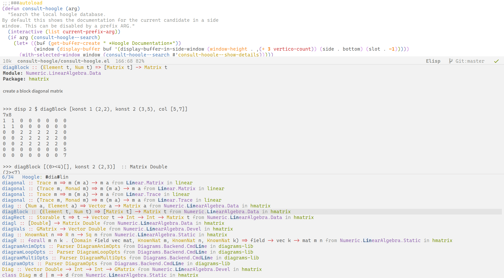
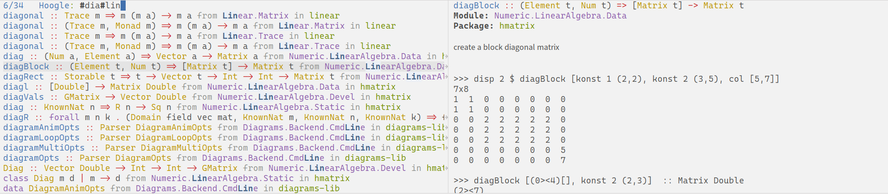

# consult-hoogle: A hoogle front end for Emacs using consult. 

*consult-hoogle* uses wraps the functionality of Haskell search engine and integrates it with the Emacs completion system with the help of [consult](https://github.com/minad/consult).

Use `M-x consult-hoogle` to begin a hoogle search. The resulting interface looks like this:

By default it shows the documentation of the selected candidate in a separate window. The documentation window can be turned by calling `consult-hoogle` with a prefix arg. Where the documentation window appears can be configured by adding an entry to `display-buffer-alist` for " *Hoogle Documentation*".

If you are using [vertico](https://github.com/minad/vertico) along with extensions, then using `vertico-buffer-mode`, the candidates and the documentation window can be arranged to appear side by side.

This will likely require configuring `display-buffer-alist` for "*vertico-buffer*" as well as " *Hoogle Documentation*". Using `vertico-buffer-mode` only for this command can be done using `vertico-multiform-mode`.
